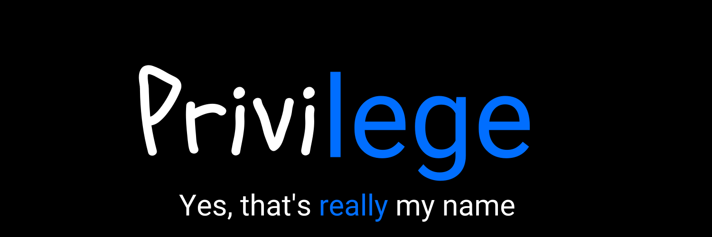

  
Hi  I'm Privilege Mendes and yes, that's really my name 🙃
============================================================================================================================================

Frontend Developer
--------------------

Highly skilled and experienced Senior Frontend Developer with 6+ years of expertise in designing, developing, and maintaining user-friendly web, SaaS, Web gaming, and Web3 based blockchain applications. Adept at leading development teams, implementing modern web technologies, and ensuring optimal performance and user experience. Proficient in JavaScript, TypeScript, React, HTML, CSS, Python and various frontend frameworks and libraries.

*   🌍  I'm based in the Netherlands, originally from South Africa 🇿🇦
*   🖥️  See my portfolio at [this link](http://lege.dev/)
*   🧠  I'm specialize in React, Typescript, and currently learning GSAP techniques
*   🤝  I'm open to collaborating on any interesting project if you have any suggestions, please write me!

## 💻 My Tech Stack:

## 📲 Contact me:
 &nbsp;

